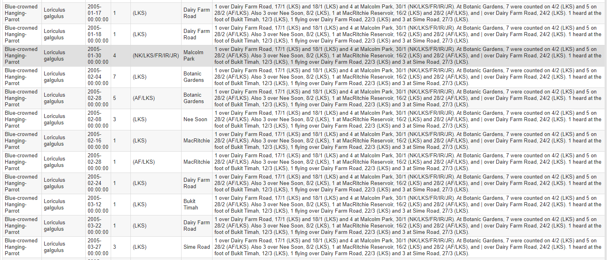

# singapore-avi-ebird

The program scraper.ipynb is used to convert .pdf files such as [this one](https://nss.org.sg/report/1eebac90-8Avi_2005_19_2.pdf) into .csv files that can be uploaded to eBird, contributing to the body of information already available there. For older, scanned reports, OCR (Optical Character Recognition) with preprocessing is used to convert them into text, which is then parsed to produce a spreadsheet file. For newer reports, which are already in text format, the OCR step is not required.

Some manual input is required; for example, when the program is confused by multiple numbers (ie. "2 seen on Track 4") or multiple locations. This occurs only rarely, and is programmed to take as little time as possible. Similarly, with outdated English or scientific names, the program requires human input (and occasionally makes mistakes, like with taxonomic changes). These have to be fixed manually after the .csv output is produced.

With modifications, the program can be used with reports written differently (with a different structure or format).

## An example:

The text summary below is reproduced from [Volume 19 Number 1 of *Singapore Avifauna*](https://nss.org.sg/report/8baffd7a-9Avi_2005_19_1.pdf). 

> BLUE-CROWNED HANGING-PARROT Loriculus galgulus

> 1 over Dairy Farm Road, 17/1 (LKS) and 18/1 (LKS) and 4 at Malcolm Park, 30/1 (NK/LKS/FR/IR/JR).  At Botanic Gardens, 7 were counted on 4/2 (LKS) and 5 on 28/2 (AF/LKS). Also 3 over Nee Soon, 8/2 (LKS), 1 at MacRitchie Reservoir, 16/2 (LKS) and 28/2 (AF/LKS), and | over Dairy Farm Road, 24/2  (LKS).  1 heard at the foot of Bukit Timah, 12/3 (LKS), 1 flying over Dairy Farm Road, 22/3 (LKS) and 3 at Sime  Road, 27/3 (LKS).

This is translated into:

